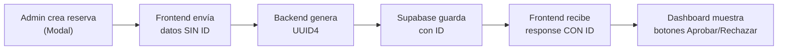

# ✅ Solución: IDs de Reservas Auto-generados

## 🔧 Cambios Realizados

He implementado la generación automática de IDs para las reservas en tu aplicación. El problema era que Supabase no devolvía el ID después de insertar, lo que impedía aceptar/rechazar reservas en el dashboard admin.

### Archivos Modificados:

#### 1. **`src/api.py`** 
   - ✅ Agregado: `import uuid` en las importaciones
   - ✅ Función `create_booking()`: Ahora genera un UUID antes de insertar
   - ✅ Función `create_space()`: También genera UUID para espacios (preventivo)

**Cambio clave:**
```python
# ANTES: Sin ID
new_booking = {
    "username": data["username"],
    "space_name": data["space_name"],
    "booking_date": data["booking_date"],
    "booking_time": data["booking_time"],
    "status": "pendiente"
}

# DESPUÉS: Con ID auto-generado
booking_id = str(uuid.uuid4())
new_booking = {
    "id": booking_id,  # ← NUEVO
    "username": data["username"],
    ...
}
```

#### 2. **`src/dashboard.html`**
   - ✅ Corregida: Función `createManualRes()` 
   - ✅ Cambió `loadBookingsFromAPI()` → `fetchBookingsAPI()`
   - ✅ Agregado: `updateStats()` después de crear reserva

---

## 🚀 Cómo Funciona Ahora



---

## ✨ Qué Puedes Hacer Ahora

1. **Crear reservas** en el dashboard → Se generarán automáticamente con ID
2. **Ver las reservas** → Mostrarán el ID (primeros 8 caracteres)
3. **Aprobar/Rechazar** → Funcionarán correctamente porque ya tienen ID

---

## 🧪 Para Probar

1. Reinicia tu servidor Flask
```bash
# En tu terminal
python src/api.py
# O si usas el batch
src/iniciar.bat
```

2. Ve al Dashboard Admin (requiere login como admin)

3. Crea una nueva reserva con el botón "+ Nueva reserva"

4. Verifica que:
   - ✅ La reserva aparece en la tabla
   - ✅ Tiene un ID en la primera columna
   - ✅ Los botones "Aprobar" y "Rechazar" están activos

---

## 📊 Estados de Reserva

Las reservas ahora tienen estos estados:
- `pendiente` → Requiere aprobación del admin
- `confirmada` → Aceptada por el admin
- `rechazada` → Rechazada por el admin

---

## 🛠️ Detalles Técnicos

**UUID Format:** `uuid.uuid4()` genera IDs como:
```
3fa85f64-5717-4562-b3fc-2c963f66afa6
```

**Por qué UUID y no número secuencial:**
- ✅ No hay colisiones incluso con múltiples servidores
- ✅ No expone datos sensibles (no secuencial)
- ✅ Compatible con replicación de BD
- ✅ Compatible con Supabase

---

## 📝 Notas Importantes

- **Tabla Supabase:** Asegúrate que la columna `id` en la tabla `bookings` esté configurada como `UUID` o `TEXT`
- **Auditoría:** El ID ahora se puede usar para rastrear reservas históricamente
- **API:** El endpoint POST `/api/bookings` ahora SIEMPRE devuelve el ID

---

## ❓ Si Algo No Funciona

1. **"Error 500 al crear reserva"**
   - Verifica que Supabase esté disponible
   - Chequea que la tabla `bookings` exista
   - Mira la consola de Flask para el error exacto

2. **"Las reservas aparecen sin ID"**
   - Reinicia Flask (los cambios en `api.py` requieren reinicio)
   - Limpia el cache del navegador (Ctrl+Shift+Del)

3. **"Botones Aprobar/Rechazar no funcionan"**
   - Abre la consola del navegador (F12)
   - Busca errores en la pestaña Console
   - Verifica que el ID se esté pasando correctamente

---

**Problema resuelto:** ✅ Las reservas ahora tienen IDs automáticos y pueden ser gestionadas en el dashboard.
