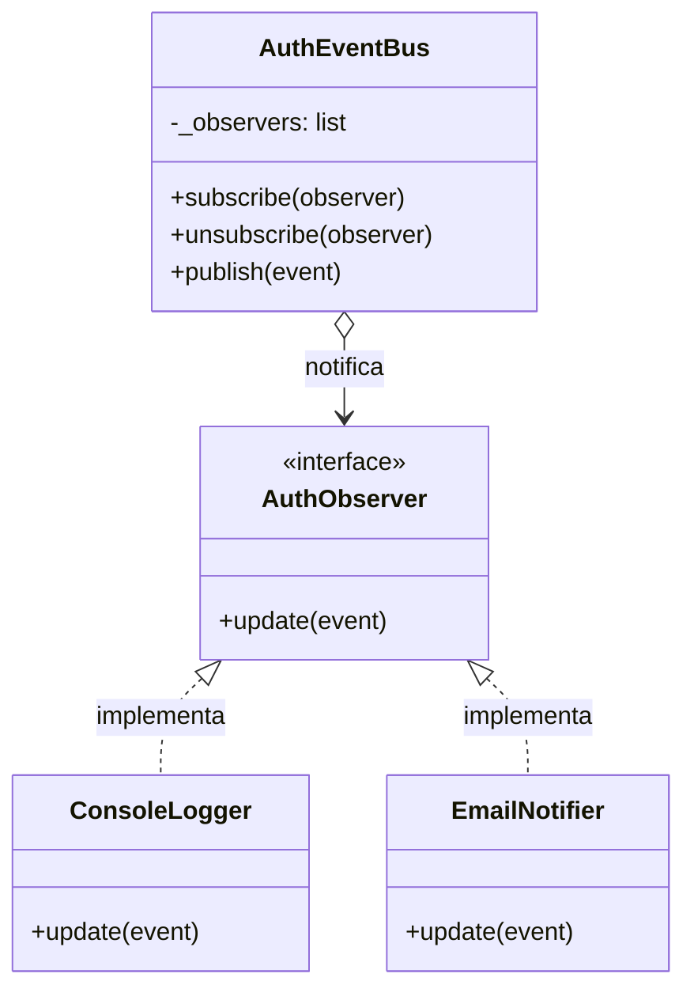
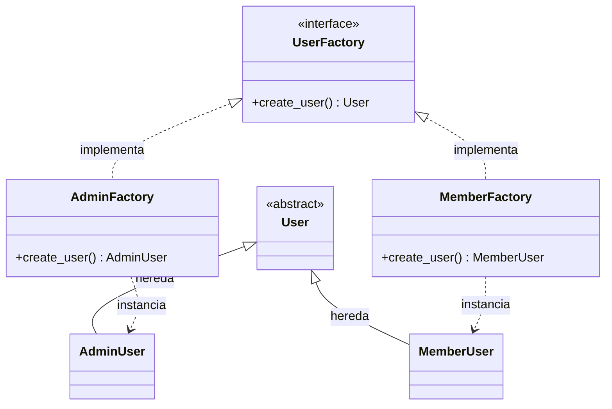

# Documentación de Patrones de Diseño - TP1 (Nexo Coworking)

Este documento detalla los patrones de diseño aplicados en el módulo de autenticación (`src/auth.py`) del sistema de reservas Nexo Coworking, justificando su uso para resolver problemas específicos de arquitectura, detallando las clases involucradas y sus consecuencias.

---

## 1. Patrón: Observer (Comportamiento)

**Intención:** Definir una dependencia de uno a muchos entre objetos, de manera que cuando un objeto cambie de estado, todos sus dependientes sean notificados y se actualicen automáticamente.

**Problema que resuelve en el sistema:**
Durante el proceso de autenticación (como registrar un usuario, fallar un inicio de sesión o bloquear una cuenta), el sistema necesita ejecutar múltiples acciones secundarias (ej: registrar un log en la consola, enviar un correo de bienvenida, o guardar un registro en la base de datos de auditoría). Si el servicio de autenticación (`AuthService`) llamara directamente a estas funciones, terminaría fuertemente acoplado a servicios externos, violando el Principio de Responsabilidad Única (SRP).

**Justificación de la elección:**
Se eligió el patrón Observer mediante la implementación de un `AuthEventBus`. Esto permite que el `AuthService` simplemente "publique" un evento (ej. `LOGIN_SUCCESS`) sin importarle quién lo está escuchando. Esto cumple con el Principio Abierto/Cerrado (OCP), ya que el día de mañana podemos agregar un nuevo observador (como un `DatabaseObserver`) sin tener que modificar ni una sola línea de código del `AuthService`.

**Clases involucradas y funcionamiento:**
* **`AuthService` (Cliente/Publicador):** Ejecuta la lógica central y contiene al `AuthEventBus`.
* **`AuthEventBus` (Sujeto):** Mantiene la lista de suscriptores y ejecuta `publish()`.
* **`AuthObserver` (Interfaz):** Define el contrato con el método `update()`.
* **`ConsoleLogger`, `EmailNotifier` (Observadores Concretos):** Implementan el "qué hacer" al recibir el evento.

**Diagrama de Clases (UML):**


**Consecuencias en la Arquitectura (Pros y Contras):**
* **✔️ Ventajas:** Bajo acoplamiento. Se pueden añadir nuevas reacciones al login sin tocar el código del core de seguridad.
* **❌ Desventajas:** El orden en que los observadores reciben la notificación es impredecible. Si un observador falla silenciosamente, puede ser difícil de depurar.

**Ejemplo en el código (`src/auth.py`):**
```python
self._event_bus.publish(AuthEvent(
    AuthEvent.USER_REGISTERED,
    {"user_id": user.user_id, "username": username, "email": email, "role": role},
))
```

---

## 2. Patrón: Factory Method (Creacional)

**Intención:**
Define una interfaz para crear un objeto, pero deja que las subclases decidan qué clase instanciar. 

**Problema que resuelve en el sistema:**
En Nexo Coworking existen diferentes perfiles: **Miembro**, **Administrador** e **Invitado**. A futuro, cada uno manejará permisos distintos. Si el `AuthService` tuviera un bloque `if/else` gigante para decidir qué clase de usuario crear al momento del registro, el código sería rígido y difícil de mantener.

**Justificación de la elección:**
Se implementó un `UserFactoryRegistry` y fábricas concretas (`MemberFactory`, `AdminFactory`). El proceso de registro (`sign_up`) es totalmente agnóstico al tipo de usuario. Si se requiere un nuevo rol "Empresa", solo se añade una nueva fábrica al registro sin modificar la lógica del servicio.

**Clases involucradas y funcionamiento:**
* **`UserFactory` (Creador Abstracto):** Interfaz que define `create_user()`.
* **`MemberFactory`, `AdminFactory` (Creadores Concretos):** Instancian perfiles específicos.
* **`User`, `AdminUser`, `MemberUser` (Productos):** Modelos de datos del dominio.
* **`UserFactoryRegistry` (Gestor):** Mapea el string del rol (ej. "admin") con la fábrica correspondiente.

**Diagrama de Clases (UML):**


**Consecuencias en la Arquitectura (Pros y Contras):**
* **✔️ Ventajas:** Cumple el principio SRP (Responsabilidad Única) moviendo la lógica de creación a clases dedicadas. Facilita la escalabilidad.
* **❌ Desventajas:** Puede producir una "explosión de clases", ya que requiere crear una nueva clase Factory por cada nueva clase de Usuario que se agregue al sistema.

**Ejemplo en el código (`src/auth.py`):**
```python
factory = UserFactoryRegistry.get(role) 
user = factory.build(username, email, password_hash)
```

---

## 3. Sinergia de Patrones en el MVP
Ambos patrones trabajan en conjunto para lograr un flujo de registro limpio: 
1. El `AuthService` recibe los datos y le pide al **Factory Method** que construya el usuario correcto según su rol. 
2. Una vez guardado en memoria, el `AuthService` utiliza el **Observer** para emitir el evento `USER_REGISTERED`, disparando las acciones secundarias (como logs y emails) sin interrumpir el flujo principal de respuesta hacia el Frontend.

